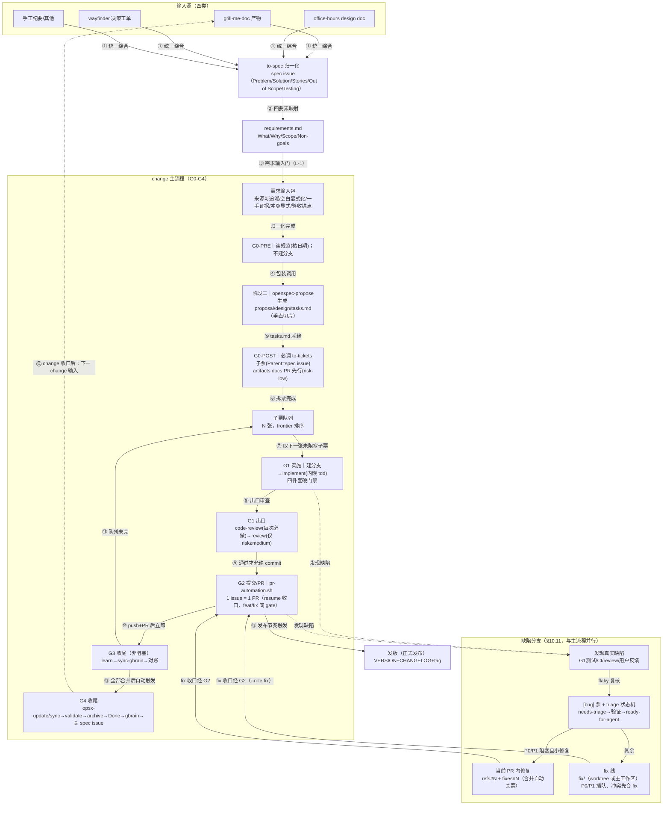

> **日常执行**：照 `agents-quick-reference.md` 四拍跑，细节回本文对应段。
> **单一事实来源**：本文是完整参考；速查卡是入口，不替代本文。
> **同步规则**：修改本文时同步检查速查卡是否需更新。

# Change Workflow — 变更生命周期总编排

本 skill 是仓库变更流程的**唯一执行入口**：把 `docs/agents/` 规范（task-tracking / issue-tracker / project-board / triage-labels / defect-workflow）与 openspec 生命周期编码为五个 gate（G0-G4），每个 gate 有显式执行 skill、checklist、自证命令；gate 失败进入 **fix-first 自愈回路**（默认自行修复，不等待用户）。配套脚本：`scripts/pr-automation.sh`（G2 机械动作）。

## 何时使用

- 用户提出新需求/新功能 → 启动新 change（走 G0）
- 接手进行中的 change/子票（分支已存在）→ 直接继续（不再逐步询问；自动接力见「会话启动」节）
- 完成任务级/change 级收尾检测
- 需要拆票、建 PR、归档 change

## 规范前置（每次进入强制执行）

1. 读取规范索引：`docs/agents/task-tracking.md`、`quality-gates.md`、`issue-tracker.md`、`project-board.md`、`triage-labels.md`、`defect-workflow.md`
2. **核对各文档头部「最后更新/生效日期」**——以最新版为准；发现旧认知与规范相悖 → 以新规范为准并记入 learnings（规范在演进，禁止按旧认知操作）
3. 术语速查（阶段 ≠ 工具 ≠ skill ≠ 脚本）：

| 名称 | 是什么 |
|---|---|
| G0-G4 | gate（流程检查点，非工具） |
| G0-PRE / G0-POST / 阶段二 | G0 的时序子阶段标签；阶段二 = openspec-propose 调用窗口（非独立 gate） |
| E2（G1 出口） | G1 内的检查点子阶段（code-review 必做 + review 条件） |
| `to-spec` / `openspec-propose` / `to-tickets` / `implement` / `tdd` / `code-review` / `review` / `learn` / `sync-gbrain` / `triage` | skill（执行者） |
| `pr-automation.sh` | 脚本（G2 机械动作：门禁/提交/push/PR） |
| `cw-evidence.sh` | 脚本（G1 出口·QG-5 证据采集：按证据分层协议采集 before/after 成对产物，落 `.artifacts/<票号>/`；无 ffmpeg/GUI 走 headless 降级） |
| `cw-evidence.sh record-state` | 子命令（G1 出口·证据 manifest 录制：创建/合并 `.artifacts/<票号>/state-coverage.json`，每态 `{state, screenshot, assertion}`；exit-3 须附机器可核验理由） |
| `cw-greploop.sh` | 脚本（G2 可选·Greptile 审查闭环：PR 创建后 risk-high 合并确认前调用；无 Greptile 降级为本地审查闭环并显式标注） |
| `cw-tickets-check.sh` | 脚本（G0-POST 拆票自检：对账/字段/AC 形态/禁入信号/DAG/豁免/规模/粒度 C1-C8 机检，发布前门禁；`--live` 对账已发子票） |
| `decisions-log.sh` | 脚本（G3 决策日志：每票追加一行 TSV——时间/阶段/决策/理由/证据指针/结果；默认落 `.artifacts/`，本地不入库） |
| 双形态规格 | 规格的人读层（proposal/design/AC 自然语言）+ 机读层（`conformance.json` 锚点），双向链接；人读层不可丢 |
| 验收锚点 | 机读锚点：含具体期望值 + 来源 + 断言类型（`exact`/`state-machine`/`perceptual`）；无具体值/来源不得成锚点 |
| 一致性制品 | 原型 `baseline/*.png` + `conformance.json` + e2e 断言骨架；G0 程序化生成，哈希锁锁定 |
| baseline | 原型基准截图，实现前锁定、禁篡改；哈希变即核验失败 |
| T1 / T2 / T3 | CI 三层自动核验：T1 确定量 / T2 感知 / T3 状态机 |
| 跨模型验证分离 | 判者 ≠ 写者，靠不同模型家族对同一 diff + 同一 baseline 独立判定（consensus），非人工 |
| `gh` / `git` / `openspec` CLI | CLI 工具（被 skill/脚本调用） |

## 会话启动：自动收尾与自动接力

每次会话启动时（任何 gate 之前）自动执行：

```bash
gh pr list --state merged --label change-close-pending --json number,title,body
```

- 对每个带 `change-close-pending` 标签的已合并 PR：
  1. 从该 PR 关闭的子票标题（`[change=<名>/`）提取 change 名
  2. 运行 §8.1 收口检查：`openspec status --change <名> --json`（completedTasks==totalTasks）+ 无残留 open 子票 + 无未合并 PR
  3. 满足 → **自动执行 G4**（sync → validate --strict → archive → 看板 Done → 关闭 spec issue）
  4. 完成后移除该 PR 的 `change-close-pending` 标签（`gh pr edit <N> --remove-label change-close-pending`）
- 不满足（仍有残留）→ 保留标签，按 G3 frontier 继续推进

> 信号由 `.github/workflows/change-closure-signal.yml` 在合并时产生（Layer 1 确定性信号）；本节为 Layer 2a 消费端——保证「合并后无需人工提醒，agent 下次会话即自动收尾」。
> 标签名可被消费仓 `.change-workflow.conf` 的 `LABEL_CLOSURE_PENDING` 改写（workflow 生产端按 conf 提取，**conf 值优先于本节字面值**）；未配置时才用默认 `change-close-pending`。同理，下文查询中的 `ready-for-agent` 可被 `LABEL_READY` 改写。

**进行中 change 自动接力（零询问）**——与本信号消费同为会话启动自动动作：

- 扫描：`gh issue list --label <LABEL_READY> --state open --json number,title,body`（标签名 conf 值优先）→ 按标题前缀 `[change=<名>/` 归组，得进行中 change 列表
- 存在可开工票（该 change 内某票 Blocked by 全 closed）→ **直接进入该票 G1 实施循环，不询问用户**；多个 change 均有可开工票 → 取最近推进者（按子票/PR 最近更新时间），并在回复中用一句话说明选择理由
- 无可开工票但存在未合并子票 PR 时按 §G3「阻塞等待」轮询；无进行中 change → 本步不做动作

## 编排路线图



## skill 调用总表

| Skill | 调用环节 | 调用方式 | 作用 / 产物 |
|---|---|---|---|
| `change-workflow` | 全流程 G0-G4 | 本 skill，总编排 | 发起 gate 检查、fix-first 自愈回路、按本表调用各 skill |
| `to-spec` | G0-PRE 步骤 1 | 必调（非结构化输入统一先综合；结构化工单可直接读） | 输入 → 1 张 spec issue（Problem/Solution/User Stories/Out of Scope/Testing，ready-for-agent），供四要素映射与 propose 输入 |
| `openspec-propose` | G0 阶段二 | 包装调用（必调） | 以归一化四要素生成 proposal/design/**tasks.md**（拆票前提；注入垂直切片约束） |
| `to-tickets` | G0-POST（阶段三） | 必调 | 以 spec issue 为输入拆子票（1 task=1 ticket，AC/Blocked by，**Parent=spec issue #S**，沿用输入源阻塞边；票面经 `cw-tickets-check.sh` 自检全绿后自动发布，无 quiz 人工确认） |
| `implement` | G1 | 必调（总编排，task-tracking §7.1 ✅） | 按 spec/tickets 实施，内嵌 tdd + 定期 typecheck/test，完成后调 code-review |
| `tdd` | G1（implement 内嵌） | 必调（内嵌） | 测试先行（红→绿 + 垂直切片），锁定行为契约 |
| `programming` | G1 | 可选叠加（task-tracking §7.1） | 代码规范对照（no any / 250 LOC 上限） |
| `openspec-apply-change` | G1 | 可选（按需） | 按 openspec 官方 tasks 指令流实施（`/opsx-apply`） |
| `code-review` | G1 出口·步骤 1 | 必调（每任务后） | 双轴自审（Standards 代码规范 + Spec 需求符合，并行防互相掩盖）；通过才允许 commit |
| `review` | G1 出口·步骤 2 | 条件调（risk-medium/high） | pre-landing 结构审查（SQL 安全/LLM trust boundary/条件副作用/scope drift）；risk-low 跳过 |
| `quality-gates`（规范，非 skill） | **G0 切片 + G1 出口 + G2 前置 + G4 收尾前置** | 必读（`docs/agents/quality-gates.md`） | QG-1..QG-8 八条硬门禁定义：QG-7 挂 G0 切片、QG-1/QG-3 挂 G0 拆票、QG-2/QG-4/QG-5 挂 G1 出口、QG-6 挂 G1 循环、QG-8 挂 G4 收尾前置 |
| `evidence-capture`（规范，非 skill） | **G1 出口·QG-5 + 缺陷线 DQ-3/DQ-5** | 必读（`docs/agents/evidence-capture.md`） | 证据分层协议（before/after 成对）+ 6 类证据规范（视频/截图/测量数字/transcript/headless 降级/视觉探针）；`cw-evidence.sh` 是其采集脚本 |
| `code-structure`（规范，非 skill） | **G1 实施 + G1 出口·code-review Standards 轴** | 条件读（`docs/agents/code-structure.md`；仅本票 diff 含新增共享逻辑或跨流程重复块时触发） | 服务层架构约束：两层分离（actions 管 why/when，service 管 how）+ 四反模式清单（God/Leaky/Inconsistent/Over-abstraction） |
| `pr-writing`（规范，非 skill） | **G2 提交前 + G3 收尾 + G4 收口评论** | 必读（`docs/agents/pr-writing.md`；只处理本次写/改的文本） | 去 AI 味：12 条 AI tells 清单 + 两遍扫描法 + add soul 原则；commit message / PR 标题正文 / learn / 收尾回复均过此规范 |
| `triage` | 缺陷状态机 | 条件调（缺陷流程内） | needs-triage → 验证/grill → ready-for-agent（附 agent brief）→ 修复 → 验证 → close |
| `learn` | G3 | 必调 | 沉淀经验（模式/陷阱/偏好）到 learnings |
| `sync-gbrain` | G3（learn 后立即） | 必调 | 刷新代码索引；push + PR 后立即，不等合并 |
| **发版**（非 skill） | G3 之后（按发布节奏） | 触发条件=正式发版 | `VERSION` + `CHANGELOG.md` 同步 → `git tag` → push；不改代码故无需 PR 评审，详见 `docs/agents/task-tracking.md` §7.6 |
| `openspec-update-change` / `openspec-sync-specs` / `openspec-archive-change` | G4 | 必调（自动触发，§8.2） | 实施漂移修订（有则做）/ 主 spec 同步（**仅合并后**）/ 归档 change |
| **明确不纳入** | — | — | `momus`（方案审计非 runtime）；`grill-with-docs`/`office-hours`/`wayfinder`（输入源识别对象，非流程内调用）；外部探索式 QA / 发布自动化 skill（如 gstack `qa`/`ship`）不进入本流程——浏览器验证由 QG-5/QG-6 承担，发版走 tag |

## 五个 gate

### G0 启动 gate（严格三段时序）

**阶段一 G0-PRE（仅 4 步）｜执行：本 skill（步骤 1 包装调用 to-spec）**

1. **输入归一化**：先调 `to-spec` 综合产出 spec issue（需求定义面）→ 四要素映射写入 requirements.md（What/Why/Scope/Non-goals，引用 spec issue URL）——产出四要素后方可继续
2. **需求输入门（L-1 契约门）**：任何以「对标 / 学习某产品 / 补齐某能力」为由的 change，在进入拆票前，其**需求输入包**（`docs/requirements/<change>/input-package.md` 或 `requirements.md` 增补段）须满足五条契约——**来源可追溯 / 空白显式化（`open-question` 阻断引用它的规格条目）/ 一手证据 / 冲突显式 / 验收锚点**；纯重构/纯文档/纯基建票显式标注 `no-ui-impact` 者豁免。违规 → fix-first：补齐后重验，不得进入拆票。
3. 读规范核对日期（见规范前置）
4. 分支：本阶段**不建任何分支**；票级分支在 G1 起步创建；接手进行中单票（分支已存在）→ 直接走 `--resume-branch`（零询问）

**阶段二 调用 openspec-propose｜执行：openspec-propose skill（本 skill 包装）**

- 以四要素为输入调用 propose，生成 proposal/design/tasks.md，并确认 `openspec status --change <名> --json` 中 tasks 就绪
- **切片约束注入**（切片只切一次）：propose 生成 tasks.md 时要求每条 task 满足 to-tickets 垂直切片原则（贯穿 schema→API→UI→test 全层 / 独立可演示可验证 / 适配单个 context window / prefactor 单独成条；过大或横向的 task 在 propose 阶段即切细）
- **QG-7 判据（强制前置）**：每条 task 必须能回答「**这张票做完，用户能否在页面上看到点东西？**」不能 → 该 task 切错了，就地重切后再进入阶段三
- **QG-3 前置**：tasks.md 中每条导出新 API 的 task，必须写明**接线归属**（由哪条 task 负责接进应用层，及具体接线位置）；无归属的接线工作不得留白
- **锚点门（M0 机检，四项缺一拒收）**：规格须为**双形态**——人读层（proposal/design/AC 自然语言）+ 机读层（`conformance.json` 锚点），双向链接。机检四项：**完备性**（每 requirement ≥1 anchor）/ **无孤儿**（anchor 回指存在 requirement）/ **可断言性**（`assert` 非空且含具体值 token）/ **来源非空**（原型 §/截图#/决策#/一手观察）。违规 → fix-first：补锚点后重验，不得进入拆票
- **一致性制品生成（M0'，实现前必做）**：有原型的 change，G0 从原型结构化表**程序化生成**一致性制品——`conformance.json` + `baseline/*.png`（每定义态基准截图）+ e2e 断言骨架；并**锁定制品哈希**。实现阶段只消费、禁篡改 baseline（哈希变即核验失败）。无原型时锚点来源须为显式决策或一手观察，否则 G0 拒收
- **生成器调用（实现前必做，有/无原型分支均执行）**：
  ```bash
  ./scripts/cw-conformance.sh generate <change>   # 解析 anchors.md → 四规则校验 → 写 conformance.json
  ./scripts/cw-conformance.sh lock <change>       # 对 conformance.json + baseline/*.png 逐文件 sha256 → 写 conformance.lock
  ```
  实现前锁定哈希；实现阶段只消费、禁篡改 baseline（哈希变即核验失败）

**阶段三 G0-POST（issue 发布面）｜执行：必调 to-tickets skill**

- 拆票逻辑与原则（垂直切片/Blocked by/frontier/expand-contract）**以 to-tickets SKILL.md 为准，本 skill 不复制**；此处仅保留仓库特化规则：**Parent 引用 = spec issue（to-tickets 原文「源 issue」语义，不另建 change parent）**、标题前缀 `[change=<名>/<task号>]`、标签 `ready-for-agent`、Blocked by 沿用输入源既有阻塞边
- 调用 to-tickets 传参 spec issue 编号（fetch 读全文评论）：输入 = #S 全文 + tasks.md → **不重复切片**；票面草稿写入 `.tickets-draft/<change>/`（每票一文件：标题 `[change=<名>/<task号>]` + Parent/What to build/Acceptance criteria/Blocked by/接线归属/标签/粒度 七字段，建票后删除）→ **发布前自检**：`./scripts/cw-tickets-check.sh --change <名>`（C1-C8 机检，退 0 才放行）→ **三项书面自答**落款 spec issue 评论（Blocked by 语义真伪 / `What` 与 spec 相符性 / 总票数匹配度，须引用 spec 原文或脚本原始输出）→ 全绿**自动发布**（按依赖序 `gh issue create`，1 task = 1 ticket，每票 Parent=#S、标签 ready-for-agent）→ 建票后 `--live` 对账复核
- 自检不通过 → fix-first 自愈：就地重切（`/opsx-update` 修订 tasks.md + 草稿）→ 重跑，循环到过；拆票环节零人工询问，升级仅限「gate 失败处理」既有三类
- artifacts docs PR 先行：`pr-automation.sh --role feat --issue <parent> --slug <change>-artifacts --risk low --files openspec/changes/...`
- **看板入列（Ready 列）——label 不会自动入列，需显式 gh project 操作**：
  ```bash
  # 一次性：取 Status 字段与选项 ID（本仓已缓存如下）
  gh api graphql -f query='query { node(id: "<PROJECT_ID>") { ... on ProjectV2 { fields(first:20){ nodes { ... on ProjectV2SingleSelectField { name id options { id name } } } } } } }'
  # 入列 + 置 Ready
  ITEM=$(gh project item-add <N> --owner <owner> --url <issue-url> --format json --jq .id)
  gh project item-edit --project-id <PROJECT_ID> --id "$ITEM" --field-id <STATUS_FIELD_ID> --single-select-option-id <READY_OPTION_ID>
  ```
  **看板常量从项目根 `.change-workflow.conf` 读取**（由 setup.sh 生成）：`PROJECT_ID` / `STATUS_FIELD_ID` / `OPT_READY` / `OPT_DONE` / `OPT_BACKLOG` / `OPT_IN_PROGRESS`
- **对账自证**：`./scripts/cw-tickets-check.sh --change <change 名> --live`（C1 双射脚本化：子票数 == tasks.md task 数、编号逐条对应；spec issue 标题不含该前缀天然排除）；**禁止占位符原样传入命令**
- **一致性制品校验（G0-POST）**：`./scripts/cw-conformance.sh verify <change>`（重投影 anchors.md 语义比对 + lock 哈希核验，退 0 才放行）

### G1 实施 gate｜执行：implement skill（总编排，task-tracking §7.1 ✅ 必用）

- **第 0 步·overlap 预检**（开工前，有重叠即停）：
  ```bash
  # 扫 open PR 改动文件
  gh pr list --state open --json number,title,files --jq '.[] | {number, title, files: [.files[].path]}'
  ```
  与本票待改文件求交集；交集非空 → **停而报告**「与 #N 改同一文件（<文件列表>），等该 PR 合并后再开工」。文件级判定（同一文件即重叠），不做行级判定。
- **第 0.5 步·建票级分支**：`git checkout -b feat/<slug> origin/main`（基于当时 origin/main，含已合并前票代码；被 Blocked by 卡住的票不得提前开工）
- **第 0.5 步·QG 前置校验**（开工前，不合格即停）：
  - **QG-1**：AC 是否含浏览器可观测陈述（`打开页面 … 之后 …`）？否则拒开工，先补 AC
  - **QG-3**：本票导出的新 API 是否已指定接线票与接线位置？否则拒开工
- implement 按 spec/tickets 实施，**内嵌 tdd**（红→绿 + 垂直切片）+ 定期 typecheck/test
- **QG-4 测试约束**：测试必须驱动**真实链路**（keydown/keymap/事件/`EditorView` 公共 API），禁止直接调内部函数；测可见性须断言**计算样式**，禁止断言「元素存在」
- **服务层架构自检**（条件触发：本票 diff 含新增共享逻辑或跨流程重复块时）：按 `docs/agents/code-structure.md` 的两层分离定义与四反模式清单自检；命中任一条须回修，不回修须在票上显式说明理由（如"当前仅单调用方，暂不抽取"）
- 四件套硬门禁：本仓门禁命令（`.change-workflow.conf` 的 `CMD_TYPECHECK` / `CMD_LINT` / `CMD_TEST`；涉 e2e 另跑 `CMD_E2E`）
- **QG-2 e2e 硬门禁**：用户可见变更**必须**新增/扩展 e2e 用例（`<E2E_DIR>` 下）；票上标 `no-ui-impact` 者豁免
- **QG-6 集成 checkpoint**：change ≥6 票时，每完成 ≤4 票执行一次——合并到集成分支 → 本仓构建命令 → **浏览器打开一次** → 记录「用户现在能看到什么」
- commit 引用 `fixes #N` / `refs #N`
- **任何「flaky」结论必须附复核证据**（重跑输出）；复核确认真实回归 → 进入缺陷处理机制（§7）
- **G1 出口（顺序固定，全部通过才允许 commit）**：
  1. `code-review` 双轴（Standards + Spec）——每任务后必做，**须逐条对照 QG-4 检查测试是否驱动真实路径**；**闭环退出条件**：未解决项未清零 → 回到修复，循环至零问题或达上限（默认 10，与 `cw-greploop.sh --max-iterations` 同款）
  2. `review`（pre-landing 结构审查）——仅 risk-medium/high 追加
  3. **QG-5 独立验证（验证分离）**：Atlas（执行者）完成 G1 实施后返回摘要（diff 统计 + 出口条件结果）；Sisyphus（编排器）**亲自跑 QG-5 探针**，把**原始输出**（标准输出 / DOM 快照 / 计算样式值 / 解析错误数 / **多态截图 state-coverage.json / 视觉探针复核记录**）**粘贴到票上**；未附原始证据的「已完成」不予采信。**两层验证互补**：Atlas 的 `lsp_diagnostics` 作为最低门槛（语法/类型），Sisyphus 的 QG-5 作为应用专属验证（业务逻辑）。证据采集按 `docs/agents/evidence-capture.md` 的证据分层协议（before/after 成对）执行，可调用 `scripts/cw-evidence.sh` 按证据类型分层采集；无 ffmpeg / 无 GUI 时走 headless 降级路径（脚本化截图 + `assertions.md` / 探针测量数字 / transcript 摘录），降级不改变 QG-5 门禁判据；`cw-evidence.sh` 退出码：0=成功 / 1=参数或子命令错误 / 3=依赖缺失降级——3 是预期路径，按脚本打印的降级指引继续，不得视为失败放弃证据纪律；**exit-3 收紧**：降级须附机器可核验理由（缺什么工具/命令 + 环境探测输出），无理由的降级视为违规；并在票上标注**验证基于的 HEAD SHA**（`git rev-parse HEAD`，记作 `QG-5 验证基于 <sha>`——rebase/追加提交后该结论即过期，G2 据此拦截）
  3.5. **探针形态（活代码优先）**：QG-5 探针优先写成仓库既有测试基建中的可复跑用例（有 e2e 套件 → 探针写成/扩展 e2e，随代码维护、`CMD_E2E` 可复跑）；无测试基建或需特定驱动时，写轻量探针并遵循 `docs/agents/evidence-capture.md` 的证据约定。不为验证另建静态技能副本——试点结论：高频迭代仓中 `verify-*` 文档必然腐烂，且与 e2e 活代码平行漂移。
  3.6. **证据 manifest 校验（ui-surface 票必做）**：ui-surface 票（label `ui-surface` ∪ diff 触及 UI 路径）须产出 `.artifacts/<票号>/state-coverage.json`（≥4 态，每态 `{state, screenshot, assertion ∈ passed|failed|untested}`），用 `cw-evidence.sh record-state` 录制；G1 出口校验 manifest 结构与关联，不合格 → fix-first 补录
  4. 通过后 → G2

> **QG-5 为何强制**（2026-09-20）：修复期抓出 **4 个「自测全绿但实际无效」**的交付，**4/4 全部由独立探针抓出，零例外**。自证无效。本地 e2e 单文件实测约 **16 秒**，成本极低。
>
> **QG-2 为何强制**（2026-09-20）：源项目某 change 的 9 个 PR 中 **8 个对应用层与 e2e 双双零改动**，12 张票全部打勾、CI 全绿，而用户打开页面**看不到任何变化**。完整根因见源项目质量复盘。

### G2 提交/PR gate｜执行：pr-automation.sh（脚本机械动作）

> 前置：G1 出口通过方可进入

- **1 issue = 1 PR，feat 与 fix 双角色同 gate**：分支已在 G1 第 0 步创建，G2 统一用 `--resume-branch <分支> --issue <票号> [--files ...] [--risk r]` 收口——resume 跳过建分支，执行四件套硬门禁 → commit `fixes #N` → push → PR 检测/创建 → 按 risk 分级合并；功能子票 `--role feat`，缺陷票 `--role fix`
- **resume 硬规则**：① 分支**已有 commit** 时必须用 `--resume-branch`（从头模式会从 origin/main 重建分支，导致既有提交的文件 pathspec 丢失）；② `--slug` 与 `--resume-branch` **互斥**（不可同时传）；③ 白名单：`--files` 外的任何工作区改动（含 untracked）都会被拒绝——规划文件未入库时先 rebase main 使其 tracked
- **parent/spec issue 的 PR 用 `--refs-only`**：PR body 用 `Refs #N` 而非 `Closes #N`，避免合并提前关闭 parent/spec issue 生命周期（G4 才收口）
- **文字质量门禁**：commit message 与 PR 标题/正文在提交前过 `docs/agents/pr-writing.md`（去 AI 味：按 12 条 tells 清单跑两遍扫描，只处理本次写的文字，不改未触碰的既有 prose）；PR 创建后发现问题用 `gh pr edit` 仅改标题/正文（不动文件）
- **成对证据（UI/行为变更）**：PR 正文 verification 段嵌入两列对比表格（| 修复前 | 修复后 |）或媒体链接，复用 QG-5 已采集的成对证据，不二次截图（规范：`docs/agents/evidence-capture.md`）
- **auto-merge**：risk-low/medium 尝试启用；仓库未启用时脚本 fail-open（提示 `gh pr merge <N> --squash`，CI 绿后执行）
- **从头模式适用场景**：artifacts docs PR（文件就绪一次成型）；单文件快速改动
- PR 模板必填项全填（impact/verification/risk）；禁止 `--skip-checks`
- **门禁引用纪律**：本次应用/豁免的每条 QG/DQ 必须在 PR body 逐条写 `QG-x / DQ-x: <它改变了哪个具体决策>`（例：`QG-5: 用真实按键探针替代测试摘要`）；只写编号 = **空引用**，不予合并（豁免的显式声明见 `docs/agents/quality-gates.md` §七）
- **验证时效（QG-5 过期拦截）**：`--resume-branch` 收口时传 `--verified-sha <票上「QG-5 验证基于」的 SHA>`；与分支 HEAD 不一致（rebase / 追加提交后未重验）→ 脚本**拒收退 1**，重跑 QG-5 后再收口；未提供 → 仅警告（risk-medium/high 应提供）
- **CI 三层自动核验（全自动无人）**：ui-surface 票的 PR 触发 `evidence-check.yml`，CI 跑三层核验——**T1 确定量**（计算样式/DOM/文本 vs `conformance.json`）/ **T2 感知**（实现截图 vs baseline 像素/感知 diff + 多模态结构化判定）/ **T3 状态机**（六态往返 + 无残留）。核验在 CI 执行、断言已提交，**不依赖人工观察**；验证分离靠**跨模型自动复核**（判者 ≠ 写者，consensus），非人工审批
- **可选审查闭环**（risk-high 合并确认前）：可调用 `scripts/cw-greploop.sh` 跑 Greptile 审查闭环（触发 → 轮询 → 修复 → resolve → 重触发；退出 = 满分零未解决评论或达 max-iterations）；无 Greptile 时降级为本地审查闭环（code-review / review 输出 + 人工清单）并在 PR 上显式标注「审查闭环降级为人工」；`cw-greploop.sh` 退出码：0=协议已打印（不代表审查通过）/ 1=参数错误或 --pr 无法解析 / 3=降级——按降级策略继续

### G3 任务级收尾（每轮必做，非阻塞）｜执行：learn + sync-gbrain

- **时机**：push + PR 创建后立即执行，不等合并
- **不阻塞下一 change**：下一 change 自 commit/push 完成后即可启动；learn/sync 是收尾动作而非前置 gate，可并行
- **frontier 自动推进（任务级零询问）**：G3 后自动运行 `gh issue list --label ready-for-agent --state open --json number,title,body` 按 `[change=<名>/` 精确筛选 → 逐票解析 Blocked by 确认全部 closed → 取第一张可开工票**立即进入其 G1**；同一 change 内连续执行到无票可做——推进全程零询问，**禁止以「是否继续下一票」之类提问结束回合**（跨会话接力见「会话启动」节）。无票可做 → change 收口检查（completedTasks==totalTasks 且无残留且无未合并 PR）→ 自动进入 G4。标签名以 conf `LABEL_READY` 为准（默认 `ready-for-agent`），conf 值优先
- **阻塞等待（有界轮询）**：frontier 为空的唯一原因是「前序票 PR 已创建未合并」（`gh pr list --state open` 命中本 change）→ 轮询该 PR 状态（`gh pr view <N> --json state`，间隔 20s、上限 10 分钟；risk-low/medium 已由 G2 尝试 auto-merge）→ 合并后**自动继续**下一票；超上限或前票待人工合并（risk-high）→ 停在合并确认点报告（合并完成后自动恢复，不询问「是否继续」）
- **决策日志（可审计轨迹）**：每票收尾追加一行——`./scripts/decisions-log.sh add <阶段> <决策> <理由> <证据指针> <结果>`；TSV 默认落 `.artifacts/decisions.tsv`（本地、不入库；需留档的项目自行纳入版本控制）。隔夜/无人值守运行结束后按它审计「做了哪些决策、为什么」（列：时间/阶段/决策/理由/证据/结果）
- **自动化边界**：任务级全程零询问（会话内连跑 + 跨会话自动接力 + 阻塞轮询等待）；唯一人工介入 = risk-high PR 合并确认；跨 change 切换停一次——G4 收口后队列盘点并询问（见 §G4）
- **learn/sync 与发版解耦**：每轮交付后的知识闭环服务下一 change/会话；发版（`VERSION`+`CHANGELOG`+tag）不改代码，无需额外 sync
- **文字质量**：learn 记录与收尾回复发布前过 `docs/agents/pr-writing.md`（T9 模糊归因在学习记录里危害最大，必须给出处）；如触发发版/PR，`cw-greploop.sh` 为可选调用（同 G2 降级策略）

### G4 change 级收尾（§8.2 自动触发，合并后）｜执行：openspec 套件 + gbrain

- 全部 tasks [x] + 关联 PR 全合并 → 主 spec `/opsx-sync`（合并后唯一时机，零差异确认）→ `validate --strict` → archive → 看板 Done → **关闭 spec issue #S**（`gh issue close --comment "change 已收口"`）→ gbrain 增量
- **`validate --strict` 与 spec delta**：spec-driven schema 要求 change 至少一个 `specs/<capability>/spec.md` delta（`## ADDED/MODIFIED Requirements` + `#### Scenario:`）。**纯文档/基建 change（tasks-only）会 validate 失败** → 处置：补最小 delta（新建/复用 capability，把变更固化为 Requirement），或确认无 spec 语义后走非 strict
- **仅 `/opsx-sync`（主 spec 同步）限合并后执行**；任务级 `sync-gbrain` 不受此限（push+PR 后立即）
- **收尾生命周期黑盒巡检（G4 前置）**：按六态清单真机走查 `打开→插入→编辑→切换→取消→关闭→空态→错误`，发现问题即**不允许收尾**（转缺陷处理机制，修复后重巡）
- **一致性制品收尾校验**：G4 收尾前校验一致性制品在位且 baseline 哈希与 G0 锁一致；哈希不一致 → 核验失败，须经独立模型复核后重新锁定，不得收尾
- **发现闭环门（QG-8）前置**：任何报告 / findings / 实测发现中记录的缺陷，须转 tracked issue 或规格条目，否则该 change **不得标记完成**（机检：findings 行数 vs issue 数）
- **剩余队列盘点（收口后必做，change 边界提醒）**：archive 与关闭 spec issue #S 后运行 `gh issue list --state open --limit 100 --json number,title,labels` → 分类输出（① 其他 change 的 `ready-for-agent` 子票；② 决策/研讨类（wayfinder 类标签或「研讨/原型」前缀）；③ 其他 open issue）→ **列出剩余清单 + 给出下一项建议 + 询问是否继续**（零询问不跨 change，此处是全流程唯一停点）；清单为空 → 明确报告「无剩余 issue」

## gate 失败处理：fix-first 自愈回路（禁止停等用户、禁止跳过）

1. **S1 诊断**：识别偏差类别（缺产物/状态错误/顺序错误/内容与规范相悖/判断错误）
2. **S2 定位正解**：读对应规范文档最新版（核对日期），确定规范要求
3. **S3 修复**：执行修复，修复动作本身符合规范（例：`gh issue reopen` 修正误标；`gh issue create` 补建；`git checkout -b` 补分支；重读规范修正台账），跑命令自证
4. **S4 重验**：重跑 gate 验证，通过 → 继续并记入 learnings
5. **升级条件（仅限 3 类）**：同一 gate 连续 2 轮修复未通过；涉及人工权限/不可逆操作；规范冲突无法裁决——升级时带完整报告（已尝试修复记录+当前状态+卡点+请裁决的具体问题）

自愈示例：

| 偏差 | 自愈动作 |
|---|---|
| 未建分支 | `git checkout -b feat/<slug> origin/main` |
| 未建 spec issue/子票 | 按 G0-PRE 1 / G0-POST 补建，Blocked by 补标注 |
| 子票被误标 CLOSED | `gh issue reopen` + 核对关闭规则（PR 合并才自动关） |
| 台账按旧规范更新 | 重读最新版规范文档，按新规则修正 |
| flaky 结论无证据 | 重跑测试附输出；流程误判 → 继续；真实回归 → 缺陷机制（建 `[bug]` 票） |
| 主 spec 提前同步（未合并） | 可回退则回退；不可回退记录偏差，合并后 sync 仅确认 |

## 交付单元关系（分支 × PR × issue：1 issue = 1 PR 轻量模型）

- **1 task = 1 issue = 1 分支 = 1 PR**：G1 第 0 步建分支 → 实施 → G2 `--resume-branch` 收口 → 独立 PR → 按 risk 独立合并 → 自动关票 → G3 对账
- **1 change 无贯穿分支**：分支生命周期 = 单票（建于 G1 第 0 步、合后即删）；Blocked by 决定开工顺位；分支基点 = 创建时刻 origin/main（含已合并前票）；并行无依赖票冲突时 rebase 消化
- **spec issue ↔ task ↔ 子票（1 : N : N）**：spec issue #S（需求定义+Parent）→ tasks.md N 条（垂直切片规划）→ N 张子票（1 task = 1 ticket）；标题前缀承载 task→ticket 对应，Parent=#S 维系三层
- **缺陷线对称**：1 bug 票 = 1 fix/<slug> = 1 PR（--role fix），与 feat 同 gate

## 缺陷处理机制（§10.11 要点，异常发现时先二分）

> **DQ-1..DQ-8 挂载点**：本节的每个环节均受 `docs/agents/quality-gates.md` §三（缺陷处理质量门禁）约束。下列每条均标注对应 DQ。

- **判定**：流程偏差 → 自愈回路；产品缺陷（真实回归/行为不符 spec/崩溃）→ 本机制
- **填报三通道**：① 聊天直报 → agent 自动补全（推断模块/级别/复现，回编号）② 手动走 bug.yml（自动带 needs-triage）③ 批量录入 → 自动拆分 N 票
- **建票**：bug.yml 模板（截图/附件作复现基线）；标题 `[bug]`（涉及 change 的再带 `[change=<名>]`）；标签 `bug, p<级别>, <模块>, needs-triage`；gh issue list 唯一事实来源（禁止本地 bug-registry 缓存）
- **状态机（DQ-1，不可跳过）**：needs-triage → 验证/grill（triage skill，产 agent brief）→ ready-for-agent → 修复 → 验证 → close
  - **开工门禁**：票上必须已移除 `needs-triage`、已加 `ready-for-agent`、**且存在 triage brief 评论**。三者缺一 → **禁止开工**（自愈：补跑 triage）
  - 反例：`#187` 全程 `needs-triage` 且评论数 0 却被直接修复
- **根因确认（DQ-2）**：票面的「修复方向 / 建议方案」是**假设不是结论**。开工前须独立复现 + 定位根因；与票面不符 → **在票上更正实际根因**（含与票面假设的对照）
  - 反例：`#187` 票面指向「拆分下载预算」，实测真根因是陈旧断言
- **分流（DQ-6 例外）**：P0/P1 阻塞且小修复（<30 行、在当前 PR 文件内）→ 当前 PR 内修复（refs#N + fixes#N）；其余 → fix 线（**两种承载**：有并行 feat 线 → worktree 隔离；无（`git branch --list 'feat/*'` 非空且 OPEN PR 判定）→ 主工作区直建）——P0/P1 插队、冲突先合 fix
  - **DQ-6 例外**：N 票**同根因/同文件/同修复** → 允许 1 PR 关 N 票，但 PR body 须**逐票 `fixes #N`** + 说明共同根因
- **修复闭环（DQ-3 / DQ-5）**：复现（**先红**，附失败原始输出）→ 建 fix/<slug> → 修复（绿，附通过原始输出）→ 四件套 → code-review → G2 `--role fix --resume-branch` 收口（fixes #N 关票）→ **回归验证重跑发现场景**
  - **DQ-3**：未附「红」证据的修复不予合并
  - **DQ-5**：关闭前由**验证者（非修复者）**跑自己的探针，把**原始输出**粘贴到票上；「测试通过/已修复/冒烟正常」是结论不是证据
- **flaky 处置（DQ-4）**：判为 flaky **必须给出「为何间歇」的机制解释**，不得以重跑通过结案。**若测试吞掉断言失败（继续执行模式），flaky 可能掩盖确定性损坏** → 必须逐步核对子步骤结论
  - 反例：`#187` 被判 flaky，真相是步骤 4/7 **确定性失败**吃掉 25s 预算，使总时长恰好跨过 120s 线而表现为「间歇」
- **收尾（DQ-8）**：关闭票时**移除 `needs-triage` / `ready-for-agent`**（关闭票残留会污染 G3 的 frontier 查询）；P0/P1 部分交付 → 票**保持 OPEN** + 评论列出已交付增量与剩余项
- **升级（DQ-7）**：**≥3 张缺陷票指向同一流程环节** → 不得只逐票修复，必须反查该环节并**产出规范修订**（QG/DQ 条目或流程文档）留痕
  - 反例：`editor-v2` 的 10 张票全部指向同一环节，却逐票修复至用户要求复盘才反查

## 速查命令

```bash
# 子票精确匹配（对账）
gh issue list --label ready-for-agent --state open --json number,title --jq '.[] | select(.title | startswith("[change=<change 名>/"))'
# frontier 下一张可开工票（解析 Blocked by 全 closed）
gh issue view <票号> --json body
# change 收口检查
openspec status --change <名> --json
# 缺陷待评估队列
gh issue list --label needs-triage --state open
```

## 明确不做

- ✗ 修改 `.opencode/skills/openspec-propose/SKILL.md` 等上游 skill（零侵入）
- ✗ 修改 `.github/ISSUE_TEMPLATE/bug.yml`（已是 `[bug]` 前缀）
- ✗ 发版走 PR 评审（发版 = `VERSION`+`CHANGELOG`+tag，不改代码；功能 PR 已在 G2 评审过）
- ✗ 复制 to-tickets/to-spec 的拆票/规格逻辑（以其 SKILL.md 为单一事实来源）
- ✗ cross-repo 复用部署（各消费仓独立配置）
