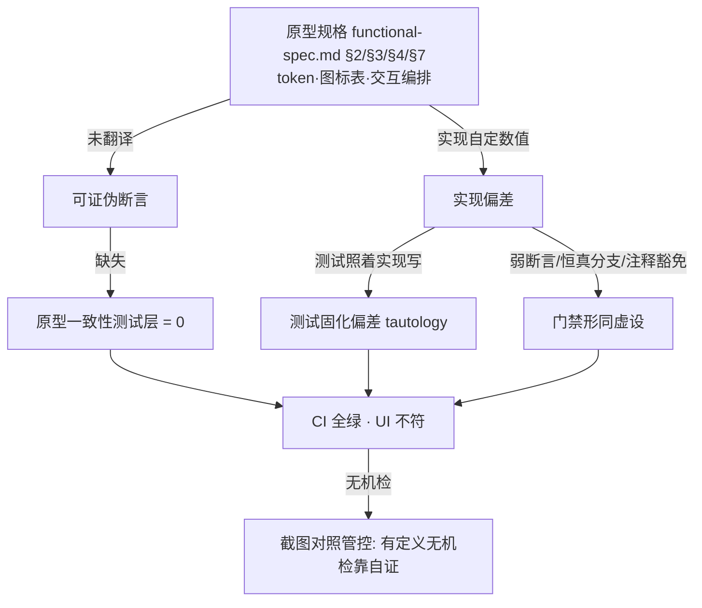

# CW 移交文档：豆包编辑态保真度——实测缺陷目录与门禁加固建议

> **移交对象**：change-workflow（CW）工具包维护方
> **同源文档**：`docs/agents/cw-fidelity-lifecycle-gates-proposal.md`（保真+生命周期提案，2026-10-03）
> **实测日期**：2026-10-04 ｜ **基线**：`http://localhost:4173/`（main `f5682b6` 之后的工作树）
> **原型基线**：`docs/doubao-editor-study/functional-spec.md` + `.lavish/doubao-editor-spec-v2.html`
> **方法**：Playwright(CDP) 直连 dev server 逐条实测（`bsk` 无已连接浏览器、`chrome-devtools-axi` 桥接 pageId 缺陷，故改用 Playwright）；所有数值为运行时 `getBoundingClientRect`/`getComputedStyle` 实测。
> **可视化评审面**：`.lavish/verify-vs-prototype.html`（含逐条截图）｜ 证据截图：`.lavish/assets/verify/*.png`

---

## 0. 一句话结论

上一轮 editor-fidelity「16/16 全绿、CI 全绿、归档」交付后，**用户打开即见约 20 处与豆包原型不符**。根因不是「没实现」，而是三重失效：**① 规格（原型）从未被翻译成可证伪断言；② 测试以「实现自身行为」为断言对象，把偏差写成预期；③ 截图对照管控「有定义、无机检、靠自证」**。本目录把每处偏差 → 原型期望 → 实测证据 → 根因 → 修复建议 → **验收判据**固化，供 CW 用作：拆票输入 + 门禁加固依据 + 回归判据。

---

## 1. 缺陷目录（A：浏览器实测确认）

> 严重度：P0=用户第一眼可见/阻断；P1=体验明显劣化；P2=规范细节。
> 证据列引用 `.lavish/assets/verify/` 下截图与实测数值。

### A. 第一轮 7 项（验证者实测）

| ID | 现象 | 原型期望（§） | 实测证据 | 根因（文件:行） | 修复建议 | 验收判据 |
|---|---|---|---|---|---|---|
| F-01 | 块手柄/菜单/斜杠菜单**无统一图标规范** | §3 `universe-icon`（`svg data-icon`）；§4.1 手柄 **42×26** 药丸=块型图标+拖拽把手；§3.2 块型图标表 | 手柄 **20×20**、段落恒 `data-icon=DragHandleOutlined`；斜杠菜单用字符字形 `# ▦ ◫ { } —` | `block-handle-dom.ts:436-437,:189`；`icons.ts` 混合注册表（H1/¶/A 文字字形+部分 SVG），命名≠规格（`ListOutlined≠DisorderListOutlined`、`TableChartOutlined≠DataSheetOutlined`、无 `DocColumnsOutlined`） | 建立「块型→图标」「动作→图标」统一 SVG 表；手柄改 42×26 两段（图标+把手）；斜杠菜单改 SVG | 手柄 `getBoundingClientRect` = 42×26；`data-icon` 命中规格命名表；斜杠菜单每个 item 含 `svg[data-icon]`（无裸字符） |
| F-02 | **点击「分栏」不显示/不插入** | §5.3 分栏项带 `›`，悬停展开「选择栏数」 | `/分栏` 仅单项 `◫分栏▸`；**Enter 不开 flyout**（需 ArrowRight）；鼠标点击行后残留 `/分栏` 且插入默认块、闭合栏变 `::<!-- -->` | `slash.ts` flyout 仅 ArrowRight(1101)/hover(546)/activateRow(812) 触发；点击路径未消费查询 | 点击父行即展开 flyout（与 hover 等价）；插入后消费整个查询串；禁止残留 | `/分栏` 单击 → flyout 可见；选 `2 栏` → `.cm-columns-2` 渲染且源码无 `/分栏` 残留 |
| F-03 | 表格**行/列「+」位置错 + 常显** | §7.2/7.4 行+在行左边界、列+在列顶边界、**悬停触发**蓝+ | 行+ **10×10@x158**（td 内，与行边界线 y367/415 **错位~27px**）；列+ **467×12 整条横杠**；`ADD_ROW_NOHOVER` 仍 `display:block` | `decorations/table.ts:782`（行+append 进首格）、`:807`（列+横条）、无 hover 门控 | 改为边界热点：行+贴行左端/列+贴列顶端，hover 门控 + 边界高亮线 | hover 单元格才出现「+」；行+y≈相邻行边界、列+x≈相邻列边界（±2px）；非 hover 时隐藏 |
| F-04 | **编辑跳动**（表格点单元格误触发插入） | §P1 静默画布；§7.4 热点不遮编辑 | 6px **隐形边界覆盖层**压在单元格上，`elementFromPoint`=`cm-table-boundary`，拦截点击 | `table.ts:972`（`position:absolute` 边界层） | 边界热点仅在贴近边界且 hover 时接管指针；单元格区域不覆盖 | 点击单元格中心 → 光标落入该单元格（不插行/列）；`elementFromPoint(cell center)` = 单元格 |
| F-05 | 手柄**未滑入即弹菜单** | §P0 悬停行→手柄；**悬停手柄**才展开菜单 | 手柄右缘距文本仅 **2px**，x=170→none、x=168→menu:block；同块内 x=100 仍开 | `block-handle.ts:419 onHandleMouseEnter→openMenu()`；定位 `contentLeft-22` | 加「显手柄→再展开菜单」缓冲（延时/位移阈值），或明确点击展开；消除与文本 2px 贴边 | 悬停**文本**不弹菜单；悬停**手柄**才弹；菜单不因块内横移而常驻 |
| F-06 | 空行「+」**超出左边线**，与手柄不齐 | §P0 空行「+」与块手柄同 gutter 列 | 空行+ **x=118** vs 手柄 **x=150**（contentLeft=140）→差 **32px** | `empty-line-entry.ts:170` 用 `contentDOM.left` **漏加 `paddingLeft`**（`block-handle.ts` 加了；文件头注释谎称同款配方） | 提取共用「gutter 坐标」函数，两处同源 | 空行+ 与块手柄 x 差 < 2px；并与 `.cm-content` padding 一致 |
| F-07 | 滚动时手柄/菜单**不消失** | §P0 用完即走；`scroll()` 应 dismiss | 滚动后仍 `display:flex`，y 漂到 **-474**；再滚 410px 仍不动 | `block-handle.ts scroll()` 重锚/消退未生效 | 修复 scroll 重锚与离视口 dismiss；`position` 改随内容或用视口判定 | 滚出视野 → 手柄 `display:none`；在视野内 → 贴当前块（±4px） |

### B. 用户补充的 10 项（验证者逐条核实）

| ID | 现象 | 原型期望（§） | 实测证据 | 根因 | 修复建议 | 验收判据 |
|---|---|---|---|---|---|---|
| U-01 | 编辑态背景色≠预览态 | 编辑=预览同底色（静默画布） | 编辑 `.cm-editor` bg=**rgb(255,255,255)**；预览 `.preview-content`=**rgb(251,250,248)** | 主题 token 未打通（edit bg 硬编码白） | 编辑画布改用与预览同源的 paper token | `getComputedStyle(.cm-editor).backgroundColor === getComputedStyle(.preview-content).backgroundColor` |
| U-02 | 高亮二级选项**重复** | 二级选项唯一 | callout flyout=「📝注释 ℹ️信息 📋摘要 📋总结 💡提示 💡提示 ⭐重要 ✅成功 ✅完成 ⚠️警告 ⚠️注意 ⚠️注意 🚨危险 ❌错误 ✖️失败 🐛问题 ❓疑问 💬帮助 💬问答 📝示例 💬引用 📖引述」——**提示×2、注意×2**，摘要/总结、成功/完成 语义近重 | `slash.ts`/callout 类型表含重复项 | 去重、按豆包 callout 类型集对齐 | flyout 项 label 集合无重复；数量与规格表一致 |
| U-03 | 块菜单**不适应窗口**，下半截显示不全 | 菜单自动翻转/夹取于视口内 | 中屏块菜单 h=262 可显示；**近底部块：手柄出现但菜单根本不弹出**，且手柄锚到 **y=-277**（错位） | `block-handle.ts openMenu` 无视口夹取/翻转；`showHandleAt` 近底部锚定失败 | 菜单定位加视口夹取+上下翻转；修近底部手柄锚定 | 任意块的菜单完整落在视口内（`bottom≤innerHeight`）；近底部块菜单正常弹出 |
| U-04 | 块菜单**快捷键不是我们特有的** | 与产品自有 keybindings 一致 | 块菜单**无任何 kbd 元素**（菜单文本仅「转换为…复制块 删除块」）；而 Ctrl/⌘+K 面板 kbd=`⌘B ⌘I ⌘⇧X ⌘E ⌘⇧7…`（我方） | 块菜单项未挂 keybinding 提示 | 块菜单动作项显示产品自有快捷键（或按豆包不显示） | 块菜单若显示 kbd，其值∈ `keybindings.ts` 定义集；否则不显示 |
| U-05 | **整体 UI 布局效仿豆包** | §1 设计哲学 P0–P7、§2 token | 见 §3 汇总（背景、间距、图标、菜单几何、色彩阶梯整体偏离） | 缺「设计 token 台账」与逐面比对 | 建立 token/间距/圆角/字阶台账，逐面比对 | token 台账逐项与原型一致 |
| U-06 | 块菜单颜色仍是**文字选项**；工具条颜色已文字+背景但色板≠豆包 | §4.5 字体色=一排 `A` 色板（默认+8色）；背景色=两排 16 格 | 块菜单 color flyout=「红色 蓝色 绿色 橙色 紫色 恢复默认」（**5 文字色，无 A 色板/无背景色**）；工具条 `.mdb-floating-toolbar` 有 `字体色 AAAAA` + `背景色 恢复默认`（A 字形，hasBg:false） | 块菜单颜色与工具条颜色两套实现、均未对齐豆包色板 | 统一为一套「A 字体色 + 背景色」子菜单；色板用原型值 | 块菜单含 `A`×9 字体色 + 背景色 16 格；色值∈原型色板 `#f0b622/#f0000e/#8a5cf6/#4c88ff/#419e34/#20b2aa/#f2962c` |
| U-07 | 二级菜单**不消失** + 下层正文前**再次弹出块转换菜单** | §P0 菜单用完即走；移开即收 | 菜单+flyout 打开后移到正文（小移/远移）：**flyout 关、父菜单仍 `block` 不关**；`onMouseMove` 在 `menuOpen` 时对指针所在块 **retarget 重开** | `block-handle.ts onMouseMove`（menuOpen 分支重开）+ 无「离开整栈即收」 | 指针离开「手柄+菜单+flyout」整栈即全部收起；删除 retarget 重开 | 指针移出菜单栈 → 菜单与 flyout 均 `display:none`；不出现随指针飘移的新菜单 |
| U-08 | Ctrl/⌘+K 面板**行间距不符** | §2 菜单行高 32px、4 的倍数、字号 12px | 面板 item **h=23px、gap=2px、padding `0 10px`、font 16px** | `command-palette-dom.ts` 行样式与 token 不一致 | 行高/间距/字号对齐原型 token | item h=32、gap∈4 倍数、font=12px |
| U-09 | 块转换菜单**在此段上方**，非正前 | §4.2 菜单出现在手柄旁、与块同高 | 块 `y=151`，菜单 `y=126`（**上方 25px**，`top:4px` 相对根） | `block-handle.ts` 菜单 top 计算未对齐块顶/手柄 | 菜单顶端对齐块顶（或手柄中心） | `menu.y ≈ block.y`（±2px） |
| U-10 | 分栏斜杠快捷键 `/fl3` 应为 `/f3` | §5 斜杠 code 语义 | `/f3` → **无匹配项**；`/fl3` → `◫3 栏 col-3` | `slash.ts:columnCount` `code:'fl'+count` | code 改 `f+count` | 输入 `/f3` 命中「3 栏」 |

### C. 验证者额外发现

| ID | 现象 | 原型期望 | 实测证据 | 根因 | 修复建议 | 验收判据 |
|---|---|---|---|---|---|---|
| F-08 | 块菜单「转为」网格**缺项** | §4.3 网格 10 项（正文/一级/二级/三级/有序/无序/待办/代码/引用/高亮） | 菜单文本=`转换为 H1 H2 H3 H4 H5 H6 ¶ 缩进和对齐 颜色 类型 上移 下移 复制块 删除块`——网格**仅 7 项**，缺 有序/无序/待办/代码/引用/高亮 6 项 | `block-handle-dom.ts` 网格项表不全；且 H1–H6 用文字字形非图标 | 补全网格为规格 10 项（图标化） | 网格项 = 规格 10 项，含 `data-icon` |
| F-09 | 手柄仅在**文本块**出现，空行无「+」联动 | §P0 空行「+」与块手柄同 gutter | 空行 hover 时 `.mdb-empty-line-add` 出现在 x=118（见 F-06）；非空行手柄 x=150 | 见 F-06 | 见 F-06 | 见 F-06 |

---

## 2. 根因总览：为什么「全绿」却「不符原型」

**三缺口证据**：
1. **零原型一致性测试**：全仓 `grep universe-icon / 42×26 / DocColumnsOutlined / DataSheetOutlined` → **0 命中**。
2. **测试固化偏差**：`block-handle-icon.spec.ts:105` 断言「段落→`DragHandleOutlined`」为正确；`block-handle-hover.spec.ts:101` 断言「悬停即开菜单」为正确。
3. **弱断言/恒真/豁免**：`block-handle-sticky.spec.ts:187` 滚动用例 `if(visible){y≥0}else{hidden}` 两分支皆过（注释写「手柄保持可见…均为可接受行为」）；`empty-line-add` 只断可见性；`table-add` 只断源码行列数+1。

---

## 3. 原型 token 台账（供逐面比对；U-05）

| 维度 | 原型值（§2 / 原型 HTML） | 现状（实测） | 差距 |
|---|---|---|---|
| 块菜单宽 | 232–**236px** | 144px | 偏窄 |
| 菜单行高 | **32px** | 块菜单项见样式 / 面板项 **23px** | 偏矮 |
| 图标 | **18px**（菜单/网格），`svg data-icon` | 16px + 部分文字字形 | 混用 |
| 块手柄 | **42×26** 药丸（图标+把手） | **20×20** 单图标 | 形态错 |
| 品牌蓝 | `#547cff` | 未逐一核对 | — |
| 悬停底 | `rgba(235,235,235,.08)` | 未逐一核对 | — |
| 编辑底色 | 与预览同源（paper） | 编辑 `#fff` vs 预览 `#fbfaf8` | **不一致** |
| 色板 | `#f0b622 #f0000e #8a5cf6 #4c88ff #419e34 #20b2aa` + callout `#f2962c` | 工具条 A 字形色板；块菜单 5 文字色 | 未对齐 |
| 间距 | 全为 **4 的倍数** | 面板 padding `0 10px`、gap 2px、3px 11px 等 | 非 4 倍数 |

---

## 4. CW 门禁加固建议（本提案的核心诉求）

> 现状：`quality-gates.md` QG-5（视觉探针强制，2026-09-20 生效）与 `evidence-capture.md`（多态截图矩阵 ≥4 态）**均已存在**；但本 change 只有 **#324** 产出了 `state-coverage.json`+多态截图，**#327–#336 全部零截图**，QG-5 证据写成了「测试通过数 + 文字描述」（QG-5 第139行明令无效的「同类探针自证」）。**根因：门禁有定义、无机器强制、靠自证。**

### 建议 1：给门禁装「牙」——机检截图证据（最高优先级）
- `scripts/pr-automation.sh` G1 出口（`--resume-branch` 收口）**新增硬校验**：交互类票（浮层/插入/渲染）必须存在 `.artifacts/<票号>/state-coverage.json` 且含 **≥4 张 `.png`** 与断言；缺失 → **退 1 拒收**。
- 把 `cw-evidence.sh` 的 **exit 3（headless 降级）** 从「默认放行」改为「需显式 `--degraded-approved` 并在票上标注降级理由」，避免其成为跳过真截图的通道。
- **反自证**：QG-5 证据不得只贴「e2e 通过数」；必须贴**原始输出**（DOM 快照/计算样式值/state-coverage.json）+ **截图**。

### 建议 2：把「多模态复核」变成必跑一步
- 交互类票的截图必须由**独立多模态复核**（`multimodal-looker` 或内置 `visual-qa` skill）逐张出「与原型一致/偏离点」结论并附票；「测试通过」不得替代。

### 建议 3：新增「原型一致性测试层」（对应 QG-9 设计→规格保真）
- 把原型的 **token 表 / 块型图标表 / 几何（42×26、32px、4 倍数）/ 交互编排** 转成可断言对象：
  - 像素位置断言（菜单 y≈块 y、行+y≈行边界、空行+与手柄对齐）；
  - hover 门控断言（非 hover 不显示「+」/菜单）；
  - `data-icon` 名称断言（∈ 规格命名表）；
  - 背景/色板 token 断言（编辑=预览、色∈原型色板）。

### 建议 4：收紧 `no-ui-impact` + 截图口径
- 浮层/插入/渲染类**不得**以 `no-ui-impact` 豁免生命周期与保真 AC（已在 QG-1 提及，需机检强制）。
- 截图必须**并排原型 vs 实现**（单张存档不算对照）。

### 建议 5：把本目录纳入「学习层证据」（对应提案 QG-8/10）
- 「学习豆包」产出必须落**可追溯一手证据**（截图/录屏 + 日期 + 来源），并**转为规格条目 + issue + 断言**，否则视为未完成（发现闭环）。

---

## 5. 建议拆票（1 task = 1 ticket，供 CW 直接使用）

| 票 | 覆盖 | 类型 | no-ui-impact |
|---|---|---|---|
| T1 | F-01 + F-08（统一图标表 + 手柄 42×26 两段 + 网格补 10 项 + 斜杠菜单图标化） | change | 否（截图） |
| T2 | F-02 + U-10（分栏入口可用 + code `/f3`） | defect | 否 |
| T3 | F-03 + F-04（表格边界热点：位置/hover 门控/不遮编辑） | defect | 否 |
| T4 | F-05 + U-07 + U-09 + F-07 + U-03（手柄/菜单编排：延迟展开、离栈即收、位置对齐、视口夹取、滚动消退） | change | 否 |
| T5 | F-06 + F-09（空行「+」坐标同源） | defect | 否 |
| T6 | U-01（编辑=预览底色） | defect | 否 |
| T7 | U-02（callout 二级去重） | defect | 否 |
| T8 | U-06（颜色子菜单统一 A+背景 + 原型色板） | change | 否 |
| T9 | U-08（面板行距 token 对齐） | defect | 否 |
| T10 | U-04（块菜单快捷键口径） | defect | 否 |
| T11 | U-05（token 台账逐面比对） | change | 否 |
| T12（CW 工具包） | 建议 1–5：截图机检 + VLM 复核 + 原型一致性测试层 | CW | — |

---

## 6. 附录

- **复跑**：探针脚本已用 Playwright 直连 `http://localhost:4173`；关键截图见 `.lavish/assets/verify/`（`editor-initial.png` `slash2.png` `cols-slash.png` `cols-flyout.png` `table-hover.png` `empty-add.png` `after-scroll.png` `v-preview.png` `v-blockmenu.png` `v-menu-bottom*.png` `v-palette5.png` `v-flyout-persist.png` `v-toolbar*.png`）。
- **可视化评审面**：`.lavish/verify-vs-prototype.html`（原型 vs 实现并排 + 根因）。
- **门禁现状证据**：`.artifacts/324/`（唯一含 `state-coverage.json` + 7 张多态截图）vs `.artifacts/327,328,329,334,335,336/`（仅 `pr-body.md`/`qg5*.md`，零截图）。
- **工具可用性备忘**：`bsk` 无已连接浏览器；`chrome-devtools-axi` snapshot/eval 报 `pageId undefined`（桥接缺陷，建议 CW 侧记录以便复现）——本次改用 Playwright(CDP) 直连，未影响取证。
