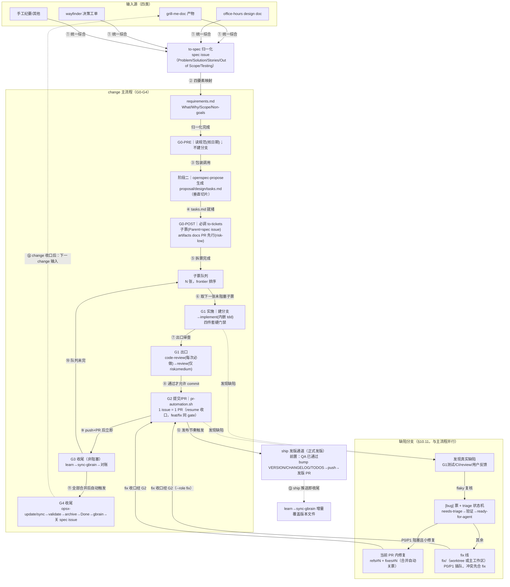

<!-- change-workflow 工具包模板 —— 由 setup.sh 安装到目标项目 docs/agents/。
     示例值（模块列表 / 看板 ID / 质量门禁命令）请按目标项目调整；
     占位符 {{REPO}} / {{PROJECT_ID}} / {{STATUS_FIELD_ID}} / {{OPT_*}} 由 setup.sh 自动替换。 -->

---
name: change-workflow
description: 变更生命周期总编排——保证 change 全流程（spec 归一化 → openspec 规划 → 拆票 → 实施 → 提交/PR → 收尾 → 归档）按仓库规范执行。启动新 change / 接手进行中 change / 拆子票 / 任务级收尾 / change 级收尾检测时使用。
allowed-tools: Bash(gh:*|git:*|openspec:*|pnpm:*)
---

# Change Workflow — 变更生命周期总编排

本 skill 是仓库变更流程的**唯一执行入口**：把 `docs/agents/` 规范（task-tracking / issue-tracker / project-board / triage-labels / defect-workflow）与 openspec 生命周期编码为五个 gate（G0-G4），每个 gate 有显式执行 skill、checklist、自证命令；gate 失败进入 **fix-first 自愈回路**（默认自行修复，不等待用户）。配套脚本：`scripts/pr-automation.sh`（G2 机械动作）。

## 何时使用

- 用户提出新需求/新功能 → 启动新 change（走 G0）
- 接手进行中的 change/子票（分支已存在）→ 确认后继续
- 完成任务级/change 级收尾检测
- 需要拆票、建 PR、归档 change

## 规范前置（每次进入强制执行）

1. 读取规范索引：`docs/agents/task-tracking.md`、`quality-gates.md`、`issue-tracker.md`、`project-board.md`、`triage-labels.md`、`defect-workflow.md`
2. **核对各文档头部「最后更新/生效日期」**——以最新版为准；发现旧认知与规范相悖 → 以新规范为准并记入 learnings（规范在演进，禁止按旧认知操作）
3. 术语速查（阶段 ≠ 工具 ≠ skill ≠ 脚本）：

| 名称 | 是什么 |
|---|---|
| G0-G4 | gate（流程检查点，非工具） |
| G0-PRE / G0-POST / 阶段二 | G0 的时序子阶段标签；阶段二 = openspec-propose 调用窗口（非独立 gate） |
| E2（G1 出口） | G1 内的检查点子阶段（code-review 必做 + review 条件） |
| `to-spec` / `openspec-propose` / `to-tickets` / `implement` / `tdd` / `code-review` / `review` / `learn` / `sync-gbrain` / `triage` / `qa` | skill（执行者） |
| `pr-automation.sh` | 脚本（G2 机械动作：门禁/提交/push/PR） |
| `gh` / `git` / `openspec` CLI / `pnpm` | CLI 工具（被 skill/脚本调用） |

## 会话启动：消费合并信号（跨会话自动收尾）

每次会话启动时（任何 gate 之前）自动执行：

```bash
gh pr list --state merged --label change-close-pending --json number,title,body
```

- 对每个带 `change-close-pending` 标签的已合并 PR：
  1. 从该 PR 关闭的子票标题（`[change=<名>/`）提取 change 名
  2. 运行 §8.1 收口检查：`openspec status --change <名> --json`（completedTasks==totalTasks）+ 无残留 open 子票 + 无未合并 PR
  3. 满足 → **自动执行 G4**（sync → validate --strict → archive → 看板 Done → 关闭 spec issue）
  4. 完成后移除该 PR 的 `change-close-pending` 标签（`gh pr edit <N> --remove-label change-close-pending`）
- 不满足（仍有残留）→ 保留标签，按 G3 frontier 继续推进

> 信号由 `.github/workflows/change-closure-signal.yml` 在合并时产生（Layer 1 确定性信号）；本节为 Layer 2a 消费端——保证「合并后无需人工提醒，agent 下次会话即自动收尾」。

## 编排路线图



## skill 调用总表

| Skill | 调用环节 | 调用方式 | 作用 / 产物 |
|---|---|---|---|
| `change-workflow` | 全流程 G0-G4 | 本 skill，总编排 | 发起 gate 检查、fix-first 自愈回路、按本表调用各 skill |
| `to-spec` | G0-PRE 步骤 1 | 必调（非结构化输入统一先综合；结构化工单可直接读） | 输入 → 1 张 spec issue（Problem/Solution/User Stories/Out of Scope/Testing，ready-for-agent），供四要素映射与 propose 输入 |
| `openspec-propose` | G0 阶段二 | 包装调用（必调） | 以归一化四要素生成 proposal/design/**tasks.md**（拆票前提；注入垂直切片约束） |
| `to-tickets` | G0-POST（阶段三） | 必调 | 以 spec issue 为输入拆子票（1 task=1 ticket，AC/Blocked by，**Parent=spec issue #S**，沿用输入源阻塞边；含 quiz 用户确认） |
| `implement` | G1 | 必调（总编排，task-tracking §7.1 ✅） | 按 spec/tickets 实施，内嵌 tdd + 定期 typecheck/test，完成后调 code-review |
| `tdd` | G1（implement 内嵌） | 必调（内嵌） | 测试先行（红→绿 + 垂直切片），锁定行为契约 |
| `programming` | G1 | 可选叠加（task-tracking §7.1） | 代码规范对照（no any / 250 LOC 上限） |
| `openspec-apply-change` | G1 | 可选（按需） | 按 openspec 官方 tasks 指令流实施（`/opsx-apply`） |
| `code-review` | G1 出口·步骤 1 | 必调（每任务后） | 双轴自审（Standards 代码规范 + Spec 需求符合，并行防互相掩盖）；通过才允许 commit |
| `review` | G1 出口·步骤 2 | 条件调（risk-medium/high） | pre-landing 结构审查（SQL 安全/LLM trust boundary/条件副作用/scope drift）；risk-low 跳过 |
| `qa` | 发版前（ship 前置）/日常按需/**QG-7 兜底** | **发版前必做**（ship-readiness 门禁）；日常 risk-high/核心模块收口前按需；**change ≥6 票时按 QG-6 在集成 checkpoint 做轻量浏览器确认** | 浏览器真机验证（Quick/Standard/Exhaustive；分支上自动 diff-aware），产出 health score + ship-readiness；QA 截图贴入缺陷票作复现基线 |
| `quality-gates`（规范，非 skill） | **G0 切片 + G1 出口 + G2 前置** | 必读（`docs/agents/quality-gates.md`） | QG-1..QG-7 七条硬门禁定义：QG-7 挂 G0 切片、QG-1/QG-3 挂 G0 拆票、QG-2/QG-4/QG-5 挂 G1 出口、QG-6 挂 G1 循环 |
| `triage` | 缺陷状态机 | 条件调（缺陷流程内） | needs-triage → 验证/grill → ready-for-agent（附 agent brief）→ 修复 → 验证 → close |
| `learn` | G3 | 必调 | 沉淀经验（模式/陷阱/偏好）到 learnings |
| `sync-gbrain` | G3（learn 后立即） | 必调 | 刷新代码索引；push + PR 后立即，不等合并 |
| `ship`（发版通道） | G3 之后（按发布节奏） | 触发条件=正式发版 **且 QA 已通过** | ship 内全链：test + coverage audit + review + 版本 bump + CHANGELOG + TODOS + commit + push + 发版 PR；**ship 推送即收尾：ship 后同样立即 learn → sync-gbrain 增量** |
| `openspec-update-change` / `openspec-sync-specs` / `openspec-archive-change` | G4 | 必调（自动触发，§8.2） | 实施漂移修订（有则做）/ 主 spec 同步（**仅合并后**）/ 归档 change |
| **明确不纳入** | — | — | `ship` 不进入日常 change 流程（仅发版通道）；`momus`（方案审计非 runtime）；`grill-with-docs`/`office-hours`/`wayfinder`（输入源识别对象，非流程内调用） |

## 五个 gate

### G0 启动 gate（严格三段时序）

**阶段一 G0-PRE（仅 3 步）｜执行：本 skill（步骤 1 包装调用 to-spec）**

1. **输入归一化**：先调 `to-spec` 综合产出 spec issue（需求定义面）→ 四要素映射写入 requirements.md（What/Why/Scope/Non-goals，引用 spec issue URL）——产出四要素后方可继续
2. 读规范核对日期（见规范前置）
3. 分支：本阶段**不建任何分支**；票级分支在 G1 起步创建；接手进行中单票（分支已存在）→ 确认后走 `--resume-branch`

**阶段二 调用 openspec-propose｜执行：openspec-propose skill（本 skill 包装）**

- 以四要素为输入调用 propose，生成 proposal/design/tasks.md，并确认 `openspec status --change <名> --json` 中 tasks 就绪
- **切片约束注入**（切片只切一次）：propose 生成 tasks.md 时要求每条 task 满足 to-tickets 垂直切片原则（贯穿 schema→API→UI→test 全层 / 独立可演示可验证 / 适配单个 context window / prefactor 单独成条；过大或横向的 task 在 propose 阶段即切细）
- **QG-7 判据（强制前置）**：每条 task 必须能回答「**这张票做完，用户能否在页面上看到点东西？**」不能 → 该 task 切错了，就地重切后再进入阶段三
- **QG-3 前置**：tasks.md 中每条导出新 API 的 task，必须写明**接线归属**（由哪条 task 负责接进 `apps/web`，及具体接线位置）；无归属的接线工作不得留白

**阶段三 G0-POST（issue 发布面）｜执行：必调 to-tickets skill**

- 拆票逻辑与原则（垂直切片/Blocked by/frontier/expand-contract）**以 to-tickets SKILL.md 为准，本 skill 不复制**；此处仅保留仓库特化规则：**Parent 引用 = spec issue（to-tickets 原文「源 issue」语义，不另建 change parent）**、标题前缀 `[change=<名>/<task号>]`、标签 `ready-for-agent`、Blocked by 沿用输入源既有阻塞边
- 调用 to-tickets 传参 spec issue 编号（fetch 读全文评论）：输入 = #S 全文 + tasks.md → **不重复切片**，职责：quiz 验收粒度（过粗/过细 → 先 `/opsx-update` 修订 tasks.md 再发）→ 确认 Blocked by → GitHub 建子票（1 task = 1 ticket，每票 What/AC/Blocked by/Parent=#S/ready-for-agent）→ 按依赖序发布
- artifacts docs PR 先行：`pr-automation.sh --role feat --issue <parent> --slug <change>-artifacts --risk low --files openspec/changes/...`
- **看板入列（Ready 列）——label 不会自动入列，需显式 gh project 操作**：
  ```bash
  # 一次性：取 Status 字段与选项 ID（本仓已缓存如下）
  gh api graphql -f query='query { node(id: "<PROJECT_ID>") { ... on ProjectV2 { fields(first:20){ nodes { ... on ProjectV2SingleSelectField { name id options { id name } } } } } } }'
  # 入列 + 置 Ready
  ITEM=$(gh project item-add <N> --owner <owner> --url <issue-url> --format json --jq .id)
  gh project item-edit --project-id <PROJECT_ID> --id "$ITEM" --field-id <STATUS_FIELD_ID> --single-select-option-id <READY_OPTION_ID>
  ```
  本仓常量：project=`{{PROJECT_ID}}`；Status 字段=`{{STATUS_FIELD_ID}}`；选项 Ready=`a50766ca` / Done=`4cbd348f`（Backlog=`8c7f2979` / In Progress=`a7011ca0`）
- **对账自证**：`gh issue list --label ready-for-agent --state open --json number,title --jq '.[] | select(.title | startswith("[change=<change 名>/"))'` 数量 == tasks.md task 数（spec issue 标题不含该前缀天然排除）；逐条核对 task 编号 ↔ issue 标题；**禁止占位符原样传入命令**

### G1 实施 gate｜执行：implement skill（总编排，task-tracking §7.1 ✅ 必用）

- **第 0 步·建票级分支**：`git checkout -b feat/<slug> origin/main`（基于当时 origin/main，含已合并前票代码；被 Blocked by 卡住的票不得提前开工）
- **第 0.5 步·QG 前置校验**（开工前，不合格即停）：
  - **QG-1**：AC 是否含浏览器可观测陈述（`打开页面 … 之后 …`）？否则拒开工，先补 AC
  - **QG-3**：本票导出的新 API 是否已指定接线票与接线位置？否则拒开工
- implement 按 spec/tickets 实施，**内嵌 tdd**（红→绿 + 垂直切片）+ 定期 typecheck/test
- **QG-4 测试约束**：测试必须驱动**真实链路**（keydown/keymap/事件/`EditorView` 公共 API），禁止直接调内部函数；测可见性须断言**计算样式**，禁止断言「元素存在」
- 四件套硬门禁：`pnpm -r typecheck` / `pnpm -r lint` / `pnpm -r test`（涉 e2e 另跑）
- **QG-2 e2e 硬门禁**：用户可见变更**必须**新增/扩展 `apps/web/test/*.spec.ts`；票上标 `no-ui-impact` 者豁免
- **QG-6 集成 checkpoint**：change ≥6 票时，每完成 ≤4 票执行一次——合并到集成分支 → `pnpm -r build` → **浏览器打开一次** → 记录「用户现在能看到什么」
- commit 引用 `fixes #N` / `refs #N`
- **任何「flaky」结论必须附复核证据**（重跑输出）；复核确认真实回归 → 进入缺陷处理机制（§7）
- **G1 出口（顺序固定，全部通过才允许 commit）**：
  1. `code-review` 双轴（Standards + Spec）——每任务后必做，**须逐条对照 QG-4 检查测试是否驱动真实路径**
  2. `review`（pre-landing 结构审查）——仅 risk-medium/high 追加
  3. **QG-5 独立验证**：验证者（orchestrator，非实施者）跑**自己的探针**，把**原始输出**（标准输出 / DOM 快照 / 计算样式值 / 解析错误数）**粘贴到票上**；未附原始证据的「已完成」不予采信
  4. 通过后 → G2

> **QG-5 为何强制**（2026-09-20）：修复期抓出 **4 个「自测全绿但实际无效」**的交付，**4/4 全部由独立探针抓出，零例外**。自证无效。本地 e2e 单文件实测约 **16 秒**，成本极低。
>
> **QG-2 为何强制**（2026-09-20）：`editor-v2` change 的 9 个 PR 中 **8 个对 `apps/web/src` 与 e2e 双双零改动**，12 张票全部打勾、CI 全绿，而用户打开页面**看不到任何变化**。完整根因见 `docs/agents/retro-editor-v2-quality.md`。

### G2 提交/PR gate｜执行：pr-automation.sh（脚本机械动作）

> 前置：G1 出口通过方可进入

- **1 issue = 1 PR，feat 与 fix 双角色同 gate**：分支已在 G1 第 0 步创建，G2 统一用 `--resume-branch <分支> --issue <票号> [--files ...] [--risk r]` 收口——resume 跳过建分支，执行四件套硬门禁 → commit `fixes #N` → push → PR 检测/创建 → 按 risk 分级合并；功能子票 `--role feat`，缺陷票 `--role fix`
- **resume 硬规则**：① 分支**已有 commit** 时必须用 `--resume-branch`（从头模式会从 origin/main 重建分支，导致既有提交的文件 pathspec 丢失）；② `--slug` 与 `--resume-branch` **互斥**（不可同时传）；③ 白名单：`--files` 外的任何工作区改动（含 untracked）都会被拒绝——规划文件未入库时先 rebase main 使其 tracked
- **parent/spec issue 的 PR 用 `--refs-only`**：PR body 用 `Refs #N` 而非 `Closes #N`，避免合并提前关闭 parent/spec issue 生命周期（G4 才收口）
- **auto-merge**：risk-low 尝试启用；仓库未启用时脚本 fail-open（提示 `gh pr merge <N> --squash`，CI 绿后执行）
- **从头模式适用场景**：artifacts docs PR（文件就绪一次成型）；单文件快速改动
- PR 模板必填项全填（impact/verification/risk）；禁止 `--skip-checks`

### G3 任务级收尾（每轮必做，非阻塞）｜执行：learn + sync-gbrain

- **时机**：push + PR 创建后立即执行，不等合并
- **不阻塞下一 change**：下一 change 自 commit/push 完成后即可启动；learn/sync 是收尾动作而非前置 gate，可并行
- **frontier 自动推进**：G3 后自动运行 `gh issue list --label ready-for-agent --state open --json number,title,body` 按 `[change=<名>/` 精确筛选 → 逐票解析 Blocked by 确认全部 closed → 取第一张可开工票自动进入其 G1（单 agent 会话内自动循环）；无票可做 → change 收口检查（completedTasks==totalTasks 且无残留且无未合并 PR）→ 自动进入 G4
- **自动化边界**：单 agent 会话内自动（frontier 推进）；跨会话由「会话启动消费 `change-close-pending` 信号」覆盖（见上节）；唯一人工介入 = risk-medium/high PR 合并确认
- **learn/sync 不依赖 ship**：每轮交付后的知识闭环服务下一 change/会话；ship 若触发，其后额外增量一次

### G4 change 级收尾（§8.2 自动触发，合并后）｜执行：openspec 套件 + gbrain

- 全部 tasks [x] + 关联 PR 全合并 → 主 spec `/opsx-sync`（合并后唯一时机，零差异确认）→ `validate --strict` → archive → 看板 Done → **关闭 spec issue #S**（`gh issue close --comment "change 已收口"`）→ gbrain 增量
- **`validate --strict` 与 spec delta**：spec-driven schema 要求 change 至少一个 `specs/<capability>/spec.md` delta（`## ADDED/MODIFIED Requirements` + `#### Scenario:`）。**纯文档/基建 change（tasks-only）会 validate 失败** → 处置：补最小 delta（新建/复用 capability，把变更固化为 Requirement），或确认无 spec 语义后走非 strict
- **仅 `/opsx-sync`（主 spec 同步）限合并后执行**；任务级 `sync-gbrain` 不受此限（push+PR 后立即）

## gate 失败处理：fix-first 自愈回路（禁止停等用户、禁止跳过）

1. **S1 诊断**：识别偏差类别（缺产物/状态错误/顺序错误/内容与规范相悖/判断错误）
2. **S2 定位正解**：读对应规范文档最新版（核对日期），确定规范要求
3. **S3 修复**：执行修复，修复动作本身符合规范（例：`gh issue reopen` 修正误标；`gh issue create` 补建；`git checkout -b` 补分支；重读规范修正台账），跑命令自证
4. **S4 重验**：重跑 gate 验证，通过 → 继续并记入 learnings
5. **升级条件（仅限 3 类）**：同一 gate 连续 2 轮修复未通过；涉及人工权限/不可逆操作；规范冲突无法裁决——升级时带完整报告（已尝试修复记录+当前状态+卡点+请裁决的具体问题）

自愈示例：

| 偏差 | 自愈动作 |
|---|---|
| 未建分支 | `git checkout -b feat/<slug> origin/main` |
| 未建 spec issue/子票 | 按 G0-PRE 1 / G0-POST 补建，Blocked by 补标注 |
| 子票被误标 CLOSED | `gh issue reopen` + 核对关闭规则（PR 合并才自动关） |
| 台账按旧规范更新 | 重读最新版规范文档，按新规则修正 |
| flaky 结论无证据 | 重跑测试附输出；流程误判 → 继续；真实回归 → 缺陷机制（建 `[bug]` 票） |
| 主 spec 提前同步（未合并） | 可回退则回退；不可回退记录偏差，合并后 sync 仅确认 |

## 交付单元关系（分支 × PR × issue：1 issue = 1 PR 轻量模型）

- **1 task = 1 issue = 1 分支 = 1 PR**：G1 第 0 步建分支 → 实施 → G2 `--resume-branch` 收口 → 独立 PR → 按 risk 独立合并 → 自动关票 → G3 对账
- **1 change 无贯穿分支**：分支生命周期 = 单票（建于 G1 第 0 步、合后即删）；Blocked by 决定开工顺位；分支基点 = 创建时刻 origin/main（含已合并前票）；并行无依赖票冲突时 rebase 消化
- **spec issue ↔ task ↔ 子票（1 : N : N）**：spec issue #S（需求定义+Parent）→ tasks.md N 条（垂直切片规划）→ N 张子票（1 task = 1 ticket）；标题前缀承载 task→ticket 对应，Parent=#S 维系三层
- **缺陷线对称**：1 bug 票 = 1 fix/<slug> = 1 PR（--role fix），与 feat 同 gate

## 缺陷处理机制（§10.11 要点，异常发现时先二分）

> **DQ-1..DQ-8 挂载点**：本节的每个环节均受 `docs/agents/quality-gates.md` §三（缺陷处理质量门禁）约束。下列每条均标注对应 DQ。

- **判定**：流程偏差 → 自愈回路；产品缺陷（真实回归/行为不符 spec/崩溃）→ 本机制
- **填报三通道**：① 聊天直报 → agent 自动补全（推断模块/级别/复现，回编号）② 手动走 bug.yml（自动带 needs-triage）③ 批量录入 → 自动拆分 N 票
- **建票**：bug.yml 模板（截图/附件作复现基线）；标题 `[bug]`（涉及 change 的再带 `[change=<名>]`）；标签 `bug, p<级别>, <模块>, needs-triage`；gh issue list 唯一事实来源（禁止本地 bug-registry 缓存）
- **状态机（DQ-1，不可跳过）**：needs-triage → 验证/grill（triage skill，产 agent brief）→ ready-for-agent → 修复 → 验证 → close
  - **开工门禁**：票上必须已移除 `needs-triage`、已加 `ready-for-agent`、**且存在 triage brief 评论**。三者缺一 → **禁止开工**（自愈：补跑 triage）
  - 反例：`#187` 全程 `needs-triage` 且评论数 0 却被直接修复
- **根因确认（DQ-2）**：票面的「修复方向 / 建议方案」是**假设不是结论**。开工前须独立复现 + 定位根因；与票面不符 → **在票上更正实际根因**（含与票面假设的对照）
  - 反例：`#187` 票面指向「拆分下载预算」，实测真根因是陈旧断言
- **分流（DQ-6 例外）**：P0/P1 阻塞且小修复（<30 行、在当前 PR 文件内）→ 当前 PR 内修复（refs#N + fixes#N）；其余 → fix 线（**两种承载**：有并行 feat 线 → worktree 隔离；无（`git branch --list 'feat/*'` 非空且 OPEN PR 判定）→ 主工作区直建）——P0/P1 插队、冲突先合 fix
  - **DQ-6 例外**：N 票**同根因/同文件/同修复** → 允许 1 PR 关 N 票，但 PR body 须**逐票 `fixes #N`** + 说明共同根因
- **修复闭环（DQ-3 / DQ-5）**：复现（**先红**，附失败原始输出）→ 建 fix/<slug> → 修复（绿，附通过原始输出）→ 四件套 → code-review → G2 `--role fix --resume-branch` 收口（fixes #N 关票）→ **回归验证重跑发现场景**
  - **DQ-3**：未附「红」证据的修复不予合并
  - **DQ-5**：关闭前由**验证者（非修复者）**跑自己的探针，把**原始输出**粘贴到票上；「测试通过/已修复/冒烟正常」是结论不是证据
- **flaky 处置（DQ-4）**：判为 flaky **必须给出「为何间歇」的机制解释**，不得以重跑通过结案。**若测试吞掉断言失败（继续执行模式），flaky 可能掩盖确定性损坏** → 必须逐步核对子步骤结论
  - 反例：`#187` 被判 flaky，真相是步骤 4/7 **确定性失败**吃掉 25s 预算，使总时长恰好跨过 120s 线而表现为「间歇」
- **收尾（DQ-8）**：关闭票时**移除 `needs-triage` / `ready-for-agent`**（关闭票残留会污染 G3 的 frontier 查询）；P0/P1 部分交付 → 票**保持 OPEN** + 评论列出已交付增量与剩余项
- **升级（DQ-7）**：**≥3 张缺陷票指向同一流程环节** → 不得只逐票修复，必须反查该环节并**产出规范修订**（QG/DQ 条目或流程文档）留痕
  - 反例：`editor-v2` 的 10 张票全部指向同一环节，却逐票修复至用户要求复盘才反查

## 速查命令

```bash
# 子票精确匹配（对账）
gh issue list --label ready-for-agent --state open --json number,title --jq '.[] | select(.title | startswith("[change=<change 名>/"))'
# frontier 下一张可开工票（解析 Blocked by 全 closed）
gh issue view <票号> --json body
# change 收口检查
openspec status --change <名> --json
# 缺陷待评估队列
gh issue list --label needs-triage --state open
```

## 明确不做

- ✗ 修改 `.opencode/skills/openspec-propose/SKILL.md` 等上游 skill（零侵入）
- ✗ 修改 `.github/ISSUE_TEMPLATE/bug.yml`（已是 `[bug]` 前缀）
- ✗ ship 进入日常 change 流程（仅发版通道）
- ✗ 复制 to-tickets/to-spec 的拆票/规格逻辑（以其 SKILL.md 为单一事实来源）
- ✗ cross-repo 复用部署（mdpkg/clairis 各仓独立配置）